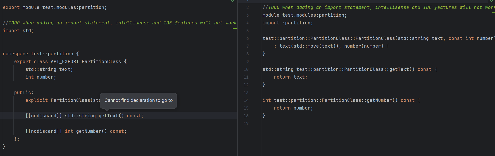

# DEMO PROJECT

The navigation and coding support features for C++20 modules are currently not functioning as expected. This issue
affects the ability to efficiently navigate through module files and utilize coding assistance features such as code
completion, refactoring, and error detection.

## Environment
- CLion 2024.2.0.1
- CMake 3.29
    - CMake Options: `-G "Visual Studio 17 2022"`
- MSVC Version 17.0
- Windows 11

